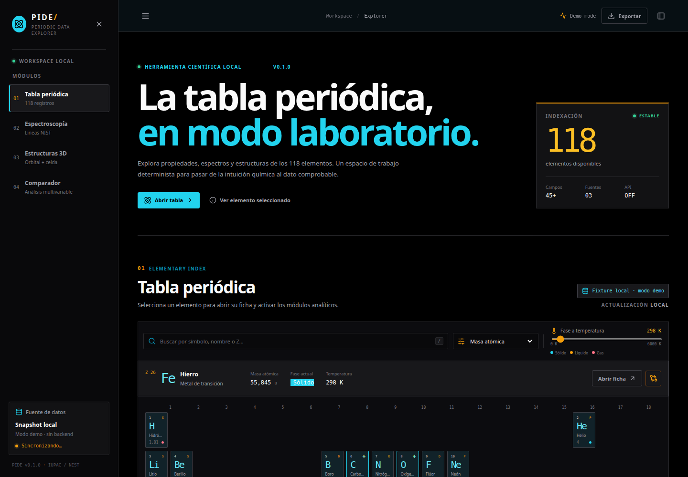
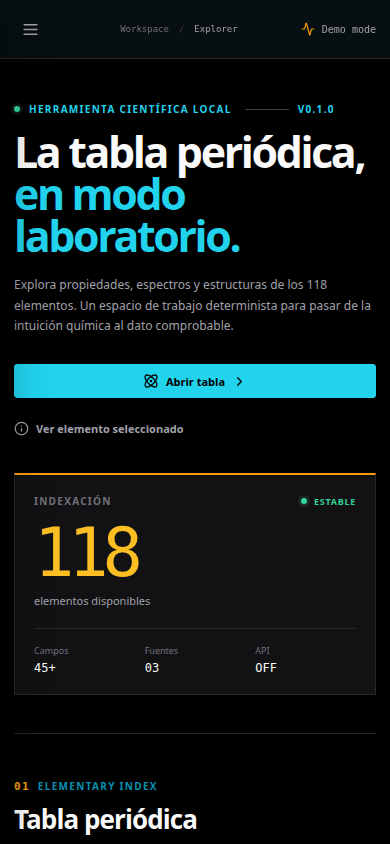

# PIDE

[](https://www.python.org/)
[](https://fastapi.tiangolo.com/)
[](https://react.dev/learn)
[](docs/architecture.md)
[](LICENSE)

**Periodic Information and Data Explorer** es una aplicación local para
explorar los 118 elementos, consultar líneas espectrales, inspeccionar modelos
atómicos y celdas cristalinas, comparar propiedades y exportar resultados. La
versión actual es `0.1.0`.

> **Atribución explícita.** PIDE es un proyecto independiente. Su repositorio
> inspirador declarado es **NIDE, de Andrés Sabogal**:
> [github.com/AndresSabogal00/NIDE](https://github.com/AndresSabogal00/NIDE).
> NIDE es un explorador local de datos nucleares evaluados; PIDE aplica una
> idea de exploración reproducible a datos periódicos y motores químicos. Esta
> mención no implica que NIDE sea una fuente de datos químicos de PIDE, ni que
> exista integración o afiliación entre ambos proyectos.

## Qué incluye

| Área | Implementación actual |
|---|---|
| Datos | Cuatro snapshots locales: elementos, espectros, cristales e isótopos; cada uno cubre `Z=1..118`. |
| API | FastAPI con 9 rutas de aplicación: `/health` y 8 rutas bajo `/api`. |
| Frontend | React 19, TypeScript estricto, Vite, SVG accesible y Three.js. |
| Motores | Registro en memoria, conversión de longitud de onda a RGB, modelo hidrogenoide, mallas de orbitales, celdas unitarias, fases y comparación estadística. |
| Exportación | CSV, LaTeX y BibTeX generados en memoria. |
| Runtime | Sin red ni LLM en runtime. El frontend conserva fixtures locales cuando la API no está disponible. |

La descripción de componentes está en
[`docs/architecture.md`](docs/architecture.md), los contratos HTTP en
[`docs/api_reference.md`](docs/api_reference.md), los motores en
[`docs/quantum_crystal_engines.md`](docs/quantum_crystal_engines.md) y la
procedencia en [`docs/data_pipeline.md`](docs/data_pipeline.md).

Guías de usuario: [English](docs/USER_GUIDE.md) y
[español](docs/GUIA_DE_USO.md).

## Capturas





## Inicio rápido

Desde la raíz de PIDE:

```bash
./setup.sh
./run.sh
```

`setup.sh` crea `.venv`, instala `backend/requirements.txt`, recompila los
snapshots y construye el frontend. Por ello puede necesitar internet durante
la instalación. `run.sh` inicia el backend en
`http://127.0.0.1:8000` y Vite en `http://127.0.0.1:5173`; el runtime de la
aplicación usa los archivos locales ya instalados.

URLs disponibles con el servidor activo:

| URL | Uso |
|---|---|
| `http://127.0.0.1:5173` | Interfaz web. |
| `http://127.0.0.1:8000/docs` | Swagger UI generado por FastAPI. |
| `http://127.0.0.1:8000/redoc` | ReDoc generado por FastAPI. |
| `http://127.0.0.1:8000/openapi.json` | Esquema OpenAPI. |
| `http://127.0.0.1:8000/health` | Estado y versión del servicio. |

### Instalación manual

Si no se usa `setup.sh`, estos comandos reproducen sus pasos principales:

```bash
python3 -m venv .venv
. .venv/bin/activate
python -m pip install -r backend/requirements.txt
python backend/scripts/build_database.py
npm --prefix frontend install
npm --prefix frontend run build
```

Para ejecutar cada proceso en terminales separadas:

```bash
PYTHONPATH="$PWD/backend" python -m uvicorn app.main:app --app-dir backend --host 127.0.0.1 --port 8000
```

```bash
npm --prefix frontend run dev -- --host 127.0.0.1
```

## Verificación

Ejecutar desde la raíz del repositorio:

```bash
python3 backend/scripts/build_database.py --check
python3 -m pytest backend/tests -q
npm --prefix frontend run build
python3 -m compileall -q backend/app backend/pide backend/scripts
```

La verificación realizada para esta documentación produjo:

| Check | Resultado observado |
|---|---|
| `build_database.py --check` | `crystals=118`, `elements=118`, `isotopes=118`, `spectra=118`. |
| `python3 -m pytest backend/tests -q` | `153 passed`; una advertencia de deprecación de `httpx`/Starlette. |
| `npm --prefix frontend run build` | `tsc -b` y Vite completaron sin error. |
| `compileall` | Sin salida de error. |

La advertencia de la suite no se oculta ni se corrige cambiando código fuera
del alcance de esta tarea.

## API mínima

Las nueve rutas de aplicación son:

| Método | Ruta | Propósito |
|---|---|---|
| `GET` | `/health` | Estado del servicio. |
| `GET` | `/api/elements` | Lista con filtros, búsqueda y paginación por offset. |
| `GET` | `/api/elements/{z}` | Ficha de un elemento. |
| `GET` | `/api/spectra/{z}` | Líneas visibles y colores RGB aproximados. |
| `GET` | `/api/orbitals/{n}/{l}/{m}` | Malla de probabilidad e isosuperficie. |
| `GET` | `/api/crystals/{z}` | Celda unitaria o respuesta explícita de indisponibilidad. |
| `GET` | `/api/trends` | Serie de una propiedad numérica frente a `Z`. |
| `POST` | `/api/compare` | Diferencias, correlaciones y valores normalizados para 2 a 8 elementos. |
| `POST` | `/api/export` | Contenido CSV, LaTeX o BibTeX sin escribir en disco. |

Ejemplos ejecutables:

```bash
curl -s http://127.0.0.1:8000/health
curl -s 'http://127.0.0.1:8000/api/elements?q=iron&limit=5'
curl -s 'http://127.0.0.1:8000/api/spectra/1?max_lines=10'
```

```bash
curl -s -X POST http://127.0.0.1:8000/api/compare \
  -H 'Content-Type: application/json' \
  -d '{"z":[6,8,26],"properties":["atomic_mass","density_g_cm3"]}'
```

## Uso de `pide`

La fachada pública no requiere levantar HTTP. Desde la raíz, con las
dependencias instaladas:

```bash
PYTHONPATH=backend python3 - <<'PY'
import pide

iron = pide.get_element(26)
print(iron.symbol, iron.atomic_mass)

report = pide.compare([6, 8, 26], ["atomic_mass", "density_g_cm3"])
print(report["properties"])
PY
```

La API pública exporta `Element`, `get_element`, `list_elements` y `compare`.
Los campos Python usan `snake_case`; las respuestas HTTP usan `camelCase`.
Consulta ejemplos adicionales en [`docs/api_reference.md`](docs/api_reference.md).

## Procedencia y límites

El compilador declara el snapshot `offline-seed-1` con `IUPAC` como fuente
primaria y `CIAAW`, `NIST ASD` y `CRC Handbook` como fuentes secundarias. Esa
declaración es metadata a nivel de registro, no una cita independiente para
cada campo. En particular:

- Las masas, clasificaciones y varias propiedades están codificadas en
  `backend/scripts/build_database.py`; `periodictable` aporta enriquecimiento
  opcional para algunos campos.
- `spectra_nist.json.gz` contiene overrides explícitos para algunos elementos;
  los demás registros usan una semilla local determinista. No se presenta como
  una copia completa de NIST ASD.
- Las celdas se generan desde tipo de red y radio covalente. No son una tabla
  cristalográfica experimental completa y sus enlaces se calculan solo entre
  átomos de la base dentro de la celda.
- Un campo faltante se serializa como `null`. No se extrapola una medición
  ausente.
- `--source-dir` está reservado para una futura importación oficial y se ignora
  en la implementación actual.

Para evaluar resultados de investigación, contrastar los valores con la
fuente primaria y conservar el snapshot utilizado. La matriz de procedencia y
los pasos de compilación están en [`docs/data_pipeline.md`](docs/data_pipeline.md).

## Referencias

- [IUPAC, Periodic Table of the Elements](https://iupac.org/what-we-do/periodic-table-of-elements/), release visible en la página y basado en el trabajo de CIAAW.
- [CIAAW, Standard Atomic Weights](https://ciaaw.org/atomic-weights.htm), tabla y notas sobre pesos atómicos estándar e intervalos isotópicos.
- [NIST Atomic Spectra Database, SRD 78](https://www.nist.gov/pml/atomic-spectra-database), niveles, longitudes de onda y probabilidades de transición evaluados.
- [CRC Handbook of Chemistry and Physics, CHEMnetBASE](https://hbcp.chemnetbase.com/), secciones de propiedades elementales, espectroscopía y estructuras cristalinas.
- [NIDE, Andrés Sabogal](https://github.com/AndresSabogal00/NIDE), repositorio inspirador atribuido explícitamente.

## Licencia y Derechos de Autor

PIDE es software libre distribuido bajo la licencia [GNU Affero General Public License v3.0 (AGPLv3)](LICENSE). Consulte el archivo [NOTICE](NOTICE) para ver las notas formales de atribución y derechos de autor, incluyendo la atribución histórica al proyecto inspirador [NIDE de Andrés Sabogal](https://github.com/AndresSabogal00/NIDE) (licenciado bajo MIT).

El uso de la marca, nombre e identidad de PIDE y de la Universidad San Sebastián se rige por la política descrita en [TRADEMARK.md](TRADEMARK.md). Las dependencias y fuentes externas conservan sus respectivas licencias.

