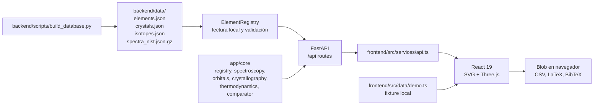

# Arquitectura de PIDE

PIDE `0.1.0` es una aplicación local con un backend FastAPI y un frontend
React 19. El backend es la fuente de verdad para los snapshots y los cálculos
cuando está disponible. El frontend conserva fixtures de demostración para que
la interfaz siga siendo navegable sin servidor.

La atribución de diseño es explícita: el repositorio inspirador declarado es
[NIDE, de Andrés Sabogal](https://github.com/AndresSabogal00/NIDE). PIDE es un
proyecto independiente y NIDE no es una fuente de datos químicos ni un servicio
que PIDE invoque.

## Vista de ejecución



El proceso de compilación puede usar `periodictable` para enriquecer campos
opcionales, pero el servidor no descarga datos. `ElementRegistry` carga los
cuatro archivos una vez y construye índices por número atómico y símbolo.

## Capas y responsabilidades

| Capa | Ubicación | Responsabilidad observable |
|---|---|---|
| Compilación | `backend/scripts/build_database.py` | Generar snapshots JSON y gzip con orden estable y metadata de origen declarada. |
| Almacenamiento | `backend/data/` | Snapshot local de elementos, espectros, cristales e isótopos. |
| Contratos | `backend/app/models.py` | Validación Pydantic, límites de entrada y serialización pública en `camelCase`. |
| Registro | `backend/app/core/registry.py` | Carga, cobertura `Z=1..118`, filtros, tendencias y resolución de propiedades. |
| Motores | `backend/app/core/*.py` | Cálculos puros o deterministas para espectros, orbitales, cristales, fases y comparaciones. |
| API | `backend/app/main.py`, `backend/app/api/` | FastAPI, CORS local, rutas, OpenAPI y errores JSON estables. |
| Cliente HTTP | `frontend/src/services/api.ts` | `fetch` contra `/api`, traducción de errores y tipos de respuesta. |
| Presentación | `frontend/src/App.tsx`, `frontend/src/components/` | Tabla, ficha, espectros, modelos 3D, comparación, tendencias y exportación. |
| Fachada Python | `backend/pide/core.py` | Acceso sin HTTP mediante `get_element`, `list_elements` y `compare`. |

## Ciclo de una petición

1. FastAPI valida parámetros de ruta, query o cuerpo con tipos estrictos y
   límites declarados en los routers y modelos.
2. La ruta solicita el registro singleton mediante `get_registry()`; la
   primera llamada carga los archivos locales y comprueba que cada tabla tenga
   exactamente los números atómicos `1` a `118`.
3. La ruta llama al motor correspondiente. Los motores no tienen un cliente
   HTTP ni una dependencia de un modelo de lenguaje.
4. Pydantic serializa nombres internos como `atomic_mass` a `atomicMass`,
   `wavelength_nm` a `wavelengthNm` y `derived_fields` a `derivedFields`.
5. `api.ts` devuelve el payload tipado. Si la petición falla, `App.tsx`
   restablece un fixture de `frontend/src/data/demo.ts` para ese módulo y
   muestra un aviso de modo demo.

## Superficie HTTP

Hay nueve rutas de aplicación, contando `/health`: una ruta de salud y ocho
operaciones bajo `/api`. Las páginas `/docs`, `/redoc` y `/openapi.json` son
las páginas de documentación que FastAPI genera por defecto, no operaciones
científicas adicionales de PIDE.

| Ruta | Motor o módulo principal | Resultado |
|---|---|---|
| `GET /health` | `app.main` | Estado, servicio y versión. |
| `GET /api/elements` | `core.registry` | Lista filtrada y paginada de `Element`. |
| `GET /api/elements/{z}` | `core.registry` | Un `Element` o error controlado. |
| `GET /api/spectra/{z}` | `core.spectroscopy` | `SpectrumResponse` con líneas visibles. |
| `GET /api/orbitals/{n}/{l}/{m}` | `core.orbitals` | Malla de probabilidad resumida y mesh. |
| `GET /api/crystals/{z}` | `core.crystallography` | Celda calculada o indisponible explícita. |
| `GET /api/trends` | `core.registry` | `TrendResponse` de una propiedad numérica. |
| `POST /api/compare` | `core.comparator` | Diferencias, correlaciones y radar normalizado. |
| `POST /api/export` | `routes/export.py` | Contenido textual y metadata de descarga. |

La referencia de parámetros y payloads está en
[`api_reference.md`](api_reference.md).

## Contratos y errores

`PideModel` configura `alias_generator=to_camel`, permite poblar por nombre
interno y descarta campos extra. Los campos opcionales conservan `null`; no se
convierten en cero ni se interpolan en la capa HTTP. Cada `Element` mantiene un
diccionario `source` de registro y una lista `derivedFields`.

Las excepciones controladas se convierten a esta forma:

```json
{
  "error": {
    "code": "VALIDATION_ERROR",
    "message": "Request validation failed",
    "details": []
  }
}
```

Los códigos usados por el backend son `VALIDATION_ERROR`, `ELEMENT_NOT_FOUND`,
`DATA_ERROR`, `NOT_FOUND`, `HTTP_ERROR` e `INTERNAL_ERROR`. Los errores 422 de
Pydantic incluyen ubicaciones (`loc`), mensaje y tipo en `details`; un error
500 genérico no expone la excepción interna.

## Frontera de red

| Momento | Red | Detalle |
|---|---|---|
| Instalación | Posible | `pip` y `npm` descargan dependencias cuando se ejecuta `setup.sh`. |
| Compilación del snapshot | No necesaria | El script lee constantes locales y la instalación local opcional de `periodictable`. |
| Runtime FastAPI | No | `ElementRegistry` abre solo archivos en `backend/data/`. |
| Runtime frontend | No para PIDE | `fetch` apunta al backend local; ante fallo se usan fixtures del bundle. |
| Exportación | No | Se devuelve una cadena y el navegador crea un `Blob`. |

CORS está limitado a `http://localhost:5173` y
`http://127.0.0.1:5173`, sin credenciales y con métodos `GET`, `POST` y
`OPTIONS`.

## Reproducibilidad

- El compilador ordena las claves JSON, usa indentación estable y comprime el
  snapshot espectral con `mtime=0`.
- Las mallas se generan con límites de tamaño explícitos y una configuración
  determinista.
- `marching_cubes` es opcional. Si `scikit-image` no está disponible o falla
  la extracción, el motor devuelve puntos de reserva y marca
  `metadata.mesh_method=points-fallback`.
- El registro valida cobertura completa antes de servir datos.
- Las correlaciones ignoran pares con valores `null` y devuelven `null` si no
  hay suficientes pares o si una variable no tiene dispersión.

La reproducibilidad numérica no equivale a exactitud experimental. La
procedencia declarada por el snapshot y sus límites se detallan en
[`data_pipeline.md`](data_pipeline.md).

## Límites arquitectónicos

- No hay base de datos persistente, autenticación, usuarios, colas ni tareas en
  segundo plano.
- No hay sincronización automática con IUPAC, CIAAW, NIST o CRC.
- La UI puede continuar en modo demo, pero un fixture demo no debe confundirse
  con el snapshot del backend.
- El modelo de orbitales es hidrogenoide y la celda cristalina es un prototipo
  geométrico; ninguno sustituye un cálculo ab initio, una evaluación
  espectroscópica completa o una tabla cristalográfica experimental.

## Referencias

- [IUPAC, Periodic Table of the Elements](https://iupac.org/what-we-do/periodic-table-of-elements/)
- [CIAAW, Standard Atomic Weights](https://ciaaw.org/atomic-weights.htm)
- [NIST Atomic Spectra Database, SRD 78](https://www.nist.gov/pml/atomic-spectra-database)
- [CRC Handbook of Chemistry and Physics, CHEMnetBASE](https://hbcp.chemnetbase.com/)
- [NIDE, Andrés Sabogal](https://github.com/AndresSabogal00/NIDE)
