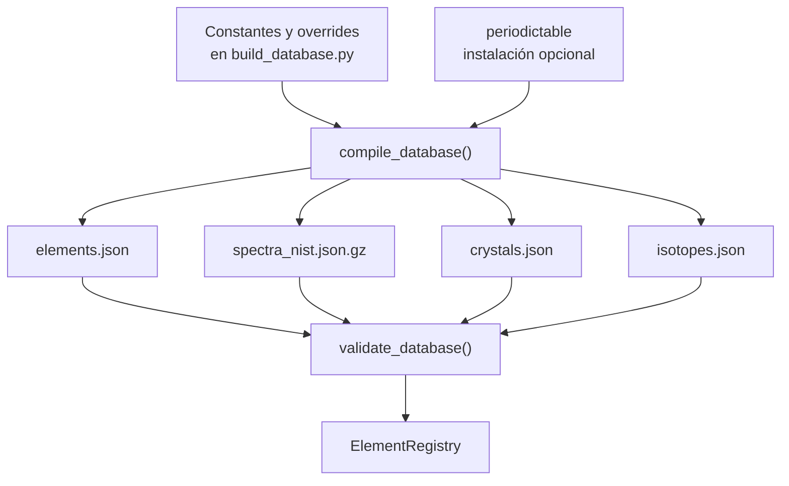

# Pipeline de datos y procedencia

PIDE distribuye un snapshot local compilado por
`backend/scripts/build_database.py`. El servidor no consulta las páginas de
IUPAC, CIAAW, NIST o CRC durante el runtime. La metadata de origen viaja con
los registros para hacer visible el contexto declarado, pero no convierte por
sí sola cada valor en una copia auditada de esas fuentes.

La atribución de proyecto también es explícita: PIDE declara como repositorio
inspirador a [NIDE, de Andrés Sabogal](https://github.com/AndresSabogal00/NIDE).
NIDE es un explorador de datos nucleares y no participa como proveedor del
snapshot químico de PIDE.

## Flujo actual



`compile_database` conserva orden de elementos `Z=1..118`, escribe JSON con
claves ordenadas y comprime el espectro con timestamp gzip fijo (`mtime=0`).
El argumento `--source-dir` existe como punto de extensión, pero el código
actual lo elimina deliberadamente y no lee esa carpeta.

## Archivos distribuidos

| Archivo | Cobertura | Contenido actual | Procedencia efectiva |
|---|---:|---|---|
| `backend/data/elements.json` | 118 | Identidad, posición periódica, masas, propiedades parciales, clasificación, textos y metadata. | Constantes de `build_database.py`; algunos campos se enriquecen desde `periodictable`; varios valores faltantes quedan `null`. |
| `backend/data/spectra_nist.json.gz` | 118 | Tres líneas o overrides por elemento antes del filtrado visible del endpoint. | Overrides explícitos para `Z=1,2,8,26` con etiqueta NIST ASD offline; el resto usa la semilla local determinista. |
| `backend/data/crystals.json` | 118 | Tipo de red, sistema, disponibilidad, celda y fuente. | Tipos/radios declarados en el compilador y simetría opcional de `periodictable`; los parámetros de celda se derivan geométricamente. |
| `backend/data/isotopes.json` | 118 | Lista de isótopos y abundancias cuando están disponibles. | Overrides explícitos para `Z=1,6,8,26,92`; después `periodictable`; en último caso, un registro de fallback basado en la masa del snapshot. |

El registro verifica que los cuatro arrays contengan exactamente los números
atómicos `1..118`, sin duplicados ni huecos, antes de servirlos.

## Leyenda de procedencia

Las siguientes etiquetas separan lo que el repositorio declara de lo que el
código efectivamente calcula:

| Etiqueta | Significado en esta documentación |
|---|---|
| `[Fuente oficial declarada]` | IUPAC, CIAAW, NIST ASD o CRC aparecen en `SOURCE_METADATA` como contexto de procedencia del snapshot. |
| `[Snapshot local]` | Valor, texto, override o clasificación fijado en `build_database.py` y reproducido offline. |
| `[Enriquecimiento de dependencia]` | Dato obtenido de la instalación local de `periodictable` si el campo está disponible. |
| `[Derivado]` | Campo o geometría calculada por el compilador o por un motor de `backend/app/core`. |
| `[Fixture demo]` | Valor creado en `frontend/src/data/demo.ts` para mantener la UI navegable sin API. No es una fuente científica. |

La metadata de registro que genera el compilador es equivalente a:

```json
{
  "primary": "IUPAC",
  "secondary": ["CIAAW", "NIST ASD", "CRC Handbook"],
  "snapshot": "offline-seed-1"
}
```

`source` está al nivel del registro, no al nivel de cada campo. La lista
`derivedFields` actual identifica `electron_configuration`, `lattice_system` e
`isotopes_count` en los elementos; no pretende ser una lista exhaustiva de
todo valor transformado.

## Detalle por dataset

### Elementos

La lista de símbolos y la tabla de masas atómicas están en el script. También
se codifican allí las reglas de periodo, grupo, bloque, categoría, estados de
oxidación, algunos puntos de cambio de fase, densidades y propiedades de
ejemplo. `periodictable` puede suministrar incertidumbres de masa, radios y
simetría cuando el registro local no tiene un valor.

Consecuencias:

- La presencia de `primary=IUPAC` no demuestra que todos los campos hayan sido
  transcritos desde IUPAC.
- Las incertidumbres y rangos isotópicos no están representados de forma
  completa en el modelo `Element`.
- El nombre `atomic_mass` es un número único, incluso cuando CIAAW recomienda
  un intervalo para composiciones naturales variables.
- Las abundancias, expansión térmica, velocidad del sonido, conductividad
  electrónica y constantes críticas pueden estar ausentes.

### Espectros

El script crea un registro para cada `Z`. Los overrides explícitos incluyen
líneas de H, He, O y Fe con `source="NIST ASD offline snapshot"`. Para los
demás elementos la longitud de onda se obtiene de una expresión modular local
y la fuente se etiqueta `deterministic local seed`.

El motor posterior:

1. descarta líneas fuera de `380..780 nm`;
2. valida que la longitud sea finita y que la intensidad no sea negativa;
3. limita la intensidad a `100`;
4. calcula RGB de visualización;
5. ordena y aplica `max_lines`.

Por eso `/api/spectra/{z}` es útil para explorar el contrato visual, pero no
debe citarse como un volcado completo de NIST ASD SRD 78.

### Isótopos

Hay overrides para hidrógeno, carbono, oxígeno, hierro y uranio. Si no existe
override, el compilador intenta leer `periodictable`. Si tampoco hay datos,
crea una entrada con número de masa redondeado, masa del snapshot y abundancia
`null`. Esta última ruta mantiene cobertura de esquema, no aporta una
medición isotópica nueva.

### Cristales

El compilador elige tipos de red y radios de una tabla local o de la simetría
disponible en `periodictable`. Con esos datos deriva `a`, `b`, `c` y ángulos;
no descarga parámetros experimentales de CRC. La ruta de API transforma la
celda en posiciones fraccionarias/cartesianas y enlaces geométricos.

La estructura calculada es un prototipo de visualización. No representa todas
las fases alotrópicas, condiciones de presión/temperatura, ocupaciones,
defectos, imágenes periódicas o incertidumbres experimentales.

## Política de valores ausentes

| Situación | Representación |
|---|---|
| Campo de elemento sin dato | `null`. |
| Lista de usos o estados no disponible | `[]` cuando el modelo define lista vacía por defecto. |
| Celda cristalina no disponible | `metadata.available=false`, red `unavailable`, átomos y enlaces vacíos. |
| Correlación sin pares válidos | `null`. |
| Fixture frontend sin backend | `source.dataset="PIDE demo snapshot"` y aviso visible de modo demo. |

No se usa cero como sustituto general de un dato faltante. La excepción de
celdas no disponibles es un contrato específico del endpoint: devuelve
parámetros cero para mantener el esquema numérico y marca la indisponibilidad
en metadata.

## Compilación y checks

Regenerar los snapshots en el directorio predeterminado:

```bash
python3 backend/scripts/build_database.py
```

Validar cobertura sin regenerar:

```bash
python3 backend/scripts/build_database.py --check
```

Salida observada en esta revisión:

```text
{"crystals": 118, "elements": 118, "isotopes": 118, "spectra": 118}
```

Checks complementarios:

| Control | Comando | Qué garantiza |
|---|---|---|
| Cobertura de snapshot | `python3 backend/scripts/build_database.py --check` | Un registro por cada `Z=1..118` en los cuatro datasets. |
| Modelos y API | `python3 -m pytest backend/tests -q` | Contratos, límites y motores cubiertos por la suite. |
| Compilación Python | `python3 -m compileall -q backend/app backend/pide backend/scripts` | Sintaxis de los módulos Python actuales. |
| Contrato frontend | `npm --prefix frontend run build` | TypeScript estricto y bundle Vite. |

La suite ejecutada durante esta revisión terminó con `153 passed` y una
advertencia de deprecación de Starlette/httpx. Ese resultado describe el
workspace inspeccionado y no congela los resultados de futuras modificaciones.

## Qué debe cambiar para una actualización oficial

Una futura importación debe, como mínimo:

1. conservar la fuente, versión, fecha de acceso y cita por campo o por tabla;
2. distinguir pesos atómicos estándar, intervalos de composición y masas
   isotópicas;
3. importar líneas y niveles de NIST ASD con su especie atómica/iónica y
   referencia, no solo una longitud de onda;
4. registrar edición y sección de CRC para cada propiedad cristalina o
   termofísica;
5. actualizar tests de valores de referencia y mantener `null` cuando la
   fuente no aporte un dato;
6. dejar de ignorar `--source-dir` solo después de documentar y probar el
   contrato de importación.

## Fuentes externas consultadas

- **[Fuente oficial declarada]** [IUPAC, Periodic Table of the Elements](https://iupac.org/what-we-do/periodic-table-of-elements/). La página indica que su release visible incorpora valores abreviados de pesos atómicos basados en la tabla CIAAW 2021.
- **[Fuente oficial declarada]** [CIAAW, Standard Atomic Weights](https://ciaaw.org/atomic-weights.htm). La página distingue pesos estándar, intervalos de composición y revisiones posteriores.
- **[Fuente oficial declarada]** [NIST Atomic Spectra Database, SRD 78](https://www.nist.gov/pml/atomic-spectra-database). NIST describe niveles, longitudes de onda y probabilidades de transición evaluados.
- **[Fuente oficial declarada]** [CRC Handbook of Chemistry and Physics, CHEMnetBASE](https://hbcp.chemnetbase.com/). La edición consultable organiza tablas de propiedades elementales, espectros y parámetros cristalinos.
- **[Atribución de proyecto]** [NIDE, Andrés Sabogal](https://github.com/AndresSabogal00/NIDE). Repositorio inspirador independiente; no es el origen de los datos locales de PIDE.
